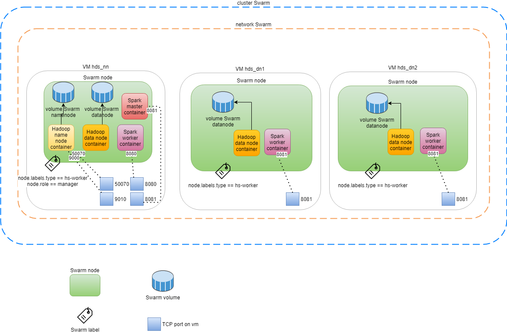

# Deploying Hadoop and Spark on a Swarm Cluster

This documents how to deploy a Hadoop cluster and a Spark cluster on top of a Swarm cluster:
on each vm a Hadoop and a Spark node are deployed



## prerequisites:
3 vms participating to a Swarm cluster. Install docker on each vm and initialize a Swarm cluster
on one vm, then let other vms join the cluster.

## network:
```shell
	docker network create -d overlay --attachable network
```

## hadoop:
```shell
	docker stack deploy -c docker-compose-hadoop.yml hadoop
```

## spark:
```shell
	docker stack deploy -c docker-compose-spark.yml spark
```

## services:
```shell
	docker stack deploy -c docker-compose-services.yml services
```